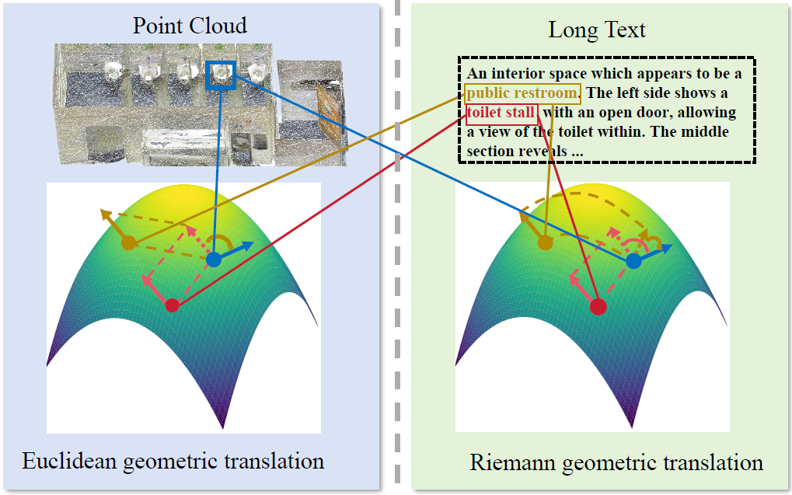
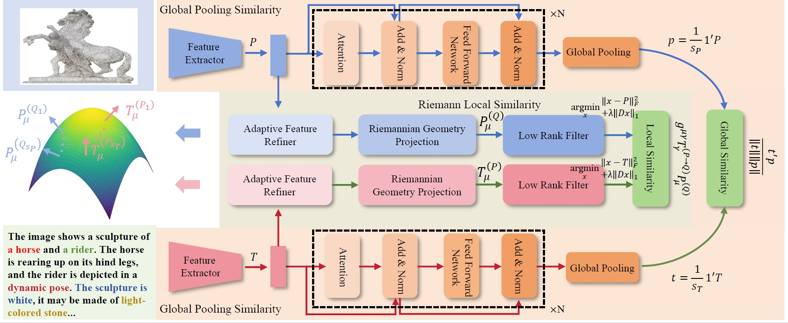
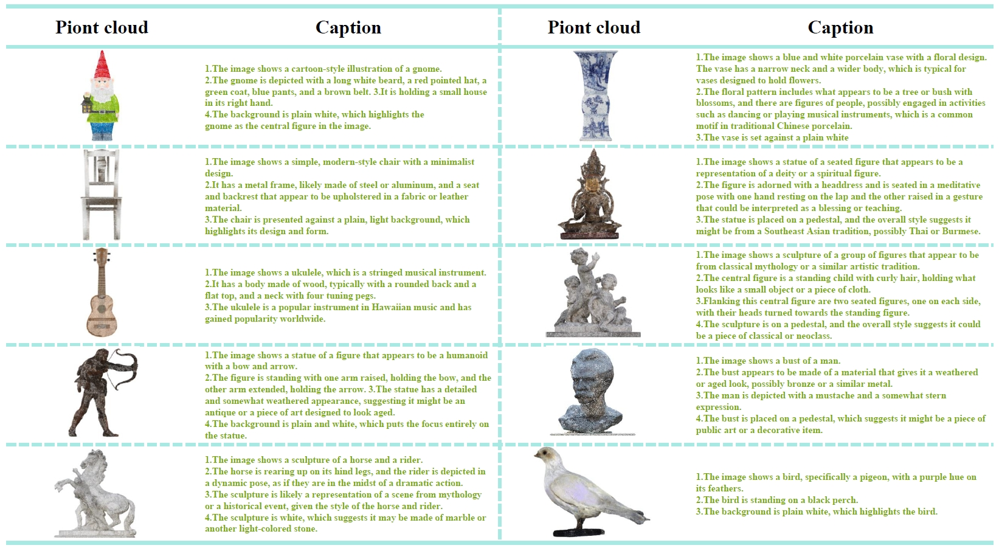

# Riemann-based Multi-scale Attention Reasoning Network for Text-3D Retrieval

[**Wenrui Li**](https://liwrui.github.io/),
**Wei Han**,
**Yandu Chen**,
**Yeyu Chai**,
**Yidan Lu**,
[**Xingtao Wang**](https://homepage.hit.edu.cn/xtwang),
[**Xiaopeng Fan**](https://scholar.google.cz/citations?hl=zh-CN&user=4LsZhDgAAAAJ&view_op=list_works&sortby=pubdate)

## Introduction
In this paper, we propose a novel Riemann-based Multi-scale Attention Reasoning Network (RMARN) for text-3D retrieval. Specifically, the extracted text and point cloud features are refined by their respective Adaptive Feature Refiner (AFR). Furthermore, we introduce the innovative Riemann Local Similarity (RLS) module and the Global Pooling Similarity (GPS) module. However, as 3D point cloud data and text data often possess complex geometric structures in high-dimensional space, the proposed RLS employs a novel Riemann Attention Mechanism to reflect the intrinsic geometric relationships of the data. Without explicitly defining the manifold, RMARN learns the manifold parameters to better represent the distances between text-point cloud samples. To address the challenges of lacking paired text-3D data, we have created the large-scale Text-3D Retrieval dataset T3DR-HIT, which comprises over 3,380 pairs of text and point cloud data. T3DR-HIT contains coarse-grained indoor 3D scenes and fine-grained Chinese artifact scenes, consisting of 1,380 and over 2,000 text-3D pairs, respectively. Experiments on our custom datasets demonstrate the superior performance of the proposed method.

## Datasets

## Codes
Coming Soon in later septemper 2024!

