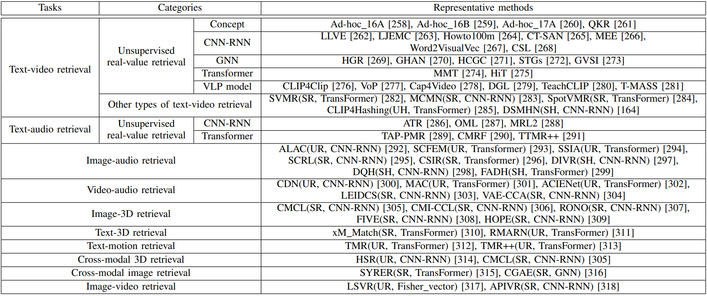

# Code Repository
We collect as many cross-modal retrieval codes as possible, all of which are original source code written by the authors themselves.

The repository is divided into two main branches: **Text-image cross-modal retrieval** and **Cross-modal retrieval beyond text-image**.

## Text-image cross-modal retrieval
Current cross-modal retrieval methods are categorized into five overarching categories: unsupervised real-value retrieval, supervised real-value retrieval, unsupervised hashing retrieval, supervised hashing retrieval, and cross-modal retrieval under special scenarios. Each of these overarching categories is subdivided based on specific technical architectures or scenarios:

## Cross-modal retrieval beyond text-image
This project also offers a comprehensive review of cross-modal retrieval methods that involve modalities beyond text-image, including text-video, text-audio, image-audio, image3D, and more. 

# Copyright Notice

These codes in the Code Repository is owned by their original authors. 
Users must acknowledge the original sources when using these codes.
We collect and provide access to these codes solely to facilitate research and advance scientific understanding. This repository does not use or distribute these codes for any commercial purposes.

