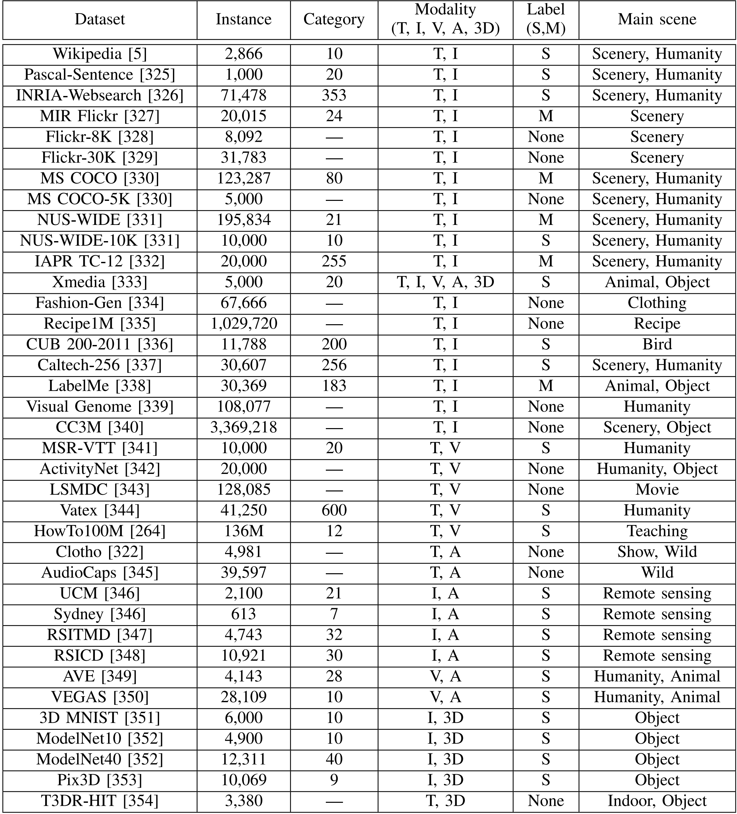

# Data Repository
We gather commonly used baseline datasets for cross-modal retrieval tasks.

## Detailed statistics for cross-modal retrieval datasets
Cross-modal retrieval datasets typically comprise multiple modalities with unique feature representations and semantic annotations. The data from different modalities are grouped or paired based on their semantic relevance or similarity. We compile commonly used datasets in various cross-modal retrieval tasks, and their statistics are as follows:

## List of datasets
**1. Wikipedia**
- **Source:** http://www.svcl.ucsd.edu/projects/crossmodal/  
- **Reference:** N. Rasiwasia, J. C. Pereira, E. Coviello, G. Doyle, G. R. G. Lanckriet, R. Levy, and N. Vasconcelos, “A new approach to cross-modal multimedia retrieval,” in ACM MM, 2010, pp. 251–260.

**2. Pascal-Sentence**  
- **Source:** http://vision.cs.uiuc.edu/pascal-sentences/  
- **Reference:** C. Rashtchian, P. Young, M. Hodosh, and J. Hockenmaier, “Collecting image annotations using amazon’s mechanical turk,” in NAACL-HLT, 2010, pp. 139–147.

**3. INRIA-Websearch**  
- **Source:** http://lear.inrialpes.fr/pubs/2010/KAVJ10/  
- **Reference:** J. Krapac, M. Allan, J. Verbeek, and F. Juried, “Improving web image search results using query-relative classifiers,” in IEEE CVPR, 2010, pp. 1094–1101.

**4. MIR Flickr**  
- **Source:** https://press.liacs.nl/mirflickr/mirdownload.html  
- **Reference:** M. J. Huiskes and M. S. Lew, “The mir flickr retrieval evaluation,” in ACM ICMIR, 2008, pp. 39–43.

**5. Flickr-8K**  
- **Source:** https://hockenmaier.cs.illinois.edu/8k-pictures.html  
- **Reference:** C. Rashtchian, P. Young, M. Hodosh, and J. Hockenmaier, “Collecting image annotations using amazons mechanical turk,” in NAACL-HLT, 2010, pp. 139–147.

**6. Flickr-30K**  
- **Source:** https://shannon.cs.illinois.edu/DenotationGraph/  
- **Reference:** P. Young, A. Lai, M. Hodosh, and J. Hockenmaier, “From image descriptions to visual denotations: New similarity metrics for semantic inference over event descriptions,” TACL, vol. 2, pp. 67–78, 2014.

**7. MS COCO**  
- **Source:** https://cocodataset.org  
- **Reference:** T.-Y. Lin, M. Maire, S. Belongie, J. Hays, P. Perona, D. Ramanan, P. Dollar, and C. L. Zitnick, “Microsoft coco: Common objects in context,” in ECCV, 2014, pp. 740–755.

**8. MS COCO-5K**  
- **Source:** https://cocodataset.org  
- **Reference:** T.-Y. Lin, M. Maire, S. Belongie, J. Hays, P. Perona, D. Ramanan, P. Dollar, and C. L. Zitnick, “Microsoft coco: Common objects in context,” in ECCV, 2014, pp. 740–755.

**9. NUS-WIDE**  
- **Source:** https://lms.comp.nus.edu.sg/wp-content/uploads/2019/research/nuswide/NUS-WIDE.html  
- **Reference:** T.-S. Chua, J. Tang, R. Hong, H. Li, Z. Luo, and Y. Zheng, “Nuswide: a real-world web image database from national university of singapore,” in ACM ICIVR, 2009, pp. 1–9.

**10. NUS-WIDE-10K**  
- **Source:** https://lms.comp.nus.edu.sg/wp-content/uploads/2019/research/nuswide/NUS-WIDE.html  
- **Reference:** T.-S. Chua, J. Tang, R. Hong, H. Li, Z. Luo, and Y. Zheng, “Nuswide: a real-world web image database from national university of singapore,” in ACM ICIVR, 2009, pp. 1–9.

**11. IAPR TC-12**  
- **Source:** https://www.imageclef.org/photodata  
- **Reference:** H. J. Escalante, C. A. Hernandez, J. A. Gonzalez, A. L opez-L opez, M. Montes, E. F. Morales, L. E. Sucar, L. Villasenor, and M. Grubinger, “The segmented and annotated iapr tc-12 benchmark,” CVIU, vol. 114, no. 4, pp. 419–428, 2010.

**12. Xmedia**  
- **Source:** http://39.108.48.32/mipl/XMediaNet  
- **Reference:** Y. Peng, X. Huang, and Y. Zhao, “An overview of cross-media retrieval: Concepts, methodologies, benchmarks, and challenges,” IEEE TCSVT, vol. 28, no. 9, pp. 2372–2385, 2017.

**13. Fashion-Gen**  
- **Source:** https://fashion-gen.com  
- **Reference:** N. Rostamzadeh, S. Hosseini, T. Boquet, W. Stokowiec, Y. Zhang, C. Jauvin, and C. Pal, “Fashion-gen: The generative fashion dataset and challenge,” arXiv preprint arXiv:1806.08317, 2018.

**14. Recipe1M**  
- **Source:** https://im2recipe.csail.mit.edu/  
- **Reference:** A. Salvador, N. Hynes, Y. Aytar, J. Marin, F. Ofli, I. Weber, and A. Torralba, “Learning cross-modal embeddings for cooking recipes and food images,” in IEEE CVPR, 2017, pp. 3020–3028.

**15. CUB 200-2011**  
- **Source:** https://www.vision.caltech.edu/datasets/cub_200_2011/  
- **Reference:** C. Wah, S. Branson, P. Welinder, P. Perona, and S. Belongie, “The caltech-ucsd birds-200-2011 dataset,” 2011.

**16. Caltech-256**  
- **Source:** https://data.caltech.edu/records/nyy15-4j048  
- **Reference:** G. Griffin, A. Holub, and P. Perona, “Caltech-256 object category dataset,” 2007.

**17. LabelMe**  
- **Source:** https://labelme.csail.mit.edu/  
- **Reference:** B. C. Russell, A. Torralba, K. P. Murphy, and W. T. Freeman, “Labelme: a database and web-based tool for image annotation,” IJCV, vol. 77, pp. 157–173, 2008.

**18. Visual Genome**  
- **Source:** https://homes.cs.washington.edu/~ranjay/visualgenome/  
- **Reference:** R. Krishna, Y. Zhu, O. Groth, J. Johnson, K. Hata, J. Kravitz, S. Chen, Y. Kalantidis, L.-J. Li, D. A. Shamma et al., “Visual genome: Connecting language and vision using crowdsourced dense image annotations,” IJCV, vol. 123, pp. 32–73, 2017.

**19. CC3M**  
- **Source:** https://huggingface.co/datasets/pixparse/cc3m-wds/  
- **Reference:** P. Sharma, N. Ding, S. Goodman, and R. Soricut, “Conceptual captions: A cleaned, hypernymed, image alt-text dataset for automatic image captioning,” in ACL, 2018, pp. 2556–2565.

**20. MSR-VTT**  
- **Source:** https://www.microsoft.com/en-us/research/publication/msr-vtt-a-large-video-description-dataset-for-bridging-video-and-language/  
- **Reference:** J. Xu, T. Mei, T. Yao, and Y. Rui, “Msr-vtt: A large video description dataset for bridging video and language,” in IEEE CVPR, 2016, pp. 5288–5296.

**21. ActivityNet**  
- **Source:** http://activity-net.org/  
- **Reference:** R. Krishna, K. Hata, F. Ren, L. Fei-Fei, and J. Carlos Niebles, “Densecaptioning events in videos,” in IEEE ICCV, 2017, pp. 706–715.

**22. LSMDC**  
- **Source:** https://sites.google.com/site/describingmovies/  
- **Reference:** A. Rohrbach, A. Torabi, M. Rohrbach, N. Tandon, C. Pal, H. Larochelle, A. Courville, and B. Schiele, “Movie description,” IJCV, vol. 123, pp. 94–120, 2017.

**23. Vatex**  
- **Source:** https://eric-xw.github.io/vatex-website/  
- **Reference:** X. Wang, J. Wu, J. Chen, L. Li, Y.-F. Wang, and W. Y. Wang, “Vatex: A large-scale, high-quality multilingual dataset for video-and-language research,” in IEEE ICCV, 2019, pp. 4581–4591.

**24. HowTo100M**  
- **Source:** https://www.di.ens.fr/willow/research/howto100m/  
- **Reference:** A. Miech, D. Zhukov, J.-B. Alayrac, M. Tapaswi, I. Laptev, and J. Sivic, “Howto100m: Learning a text-video embedding by watching hundred million narrated video clips,” in IEEE ICCV, 2019, pp. 2630–2640.

**25. Clotho**  
- **Source:** https://zenodo.org/records/3490684  
- **Reference:** K. Drossos, S. Lipping, and T. Virtanen, “Clotho: An audio captioning dataset,” in IEEE ICASSP, 2020, pp. 736–740.

**26. AudioCaps**  
- **Source:** https://audiocaps.github.io/  
- **Reference:** C. D. Kim, B. Kim, H. Lee, and G. Kim, “Audiocaps: Generating captions for audios in the wild,” in NAACL-HLT, 2019, pp. 119–132.

**27. UCM**  
- **Source:** https://pan.baidu.com/s/1mjPToHq#list/path=%2F  
- **Reference:** B. Qu, X. Li, D. Tao, and X. Lu, “Deep semantic understanding of high resolution remote sensing image,” in IEEE CITS, 2016, pp. 1–5.

**28. Sydney**  
- **Source:** https://pan.baidu.com/s/1hujEmcG#list/path=%2F  
- **Reference:** B. Qu, X. Li, D. Tao, and X. Lu, “Deep semantic understanding of high resolution remote sensing image,” in IEEE CITS, 2016, pp. 1–5.

**29. RSITMD**  
- **Source:** https://github.com/xiaoyuan1996/AMFMN/blob/master/RSITMD  
- **Reference:** Z. Yuan, W. Zhang, K. Fu, X. Li, C. Deng, H. Wang, and X. Sun, “Exploring a fine-grained multiscale method for cross-modal remote sensing image retrieval,” IEEE TGRS, vol. 60, pp. 1–19, 2021.

**30. RSICD**  
- **Source:** https://github.com/201528014227051/RSICD_optimal  
- **Reference:** X. Lu, B. Wang, X. Zheng, and X. Li, “Exploring models and data for remote sensing image caption generation,” IEEE TGRS, vol. 56, no. 4, pp. 2183–2195, 2017.

**31. AVE**  
- **Source:** https://sites.google.com/view/audiovisualresearch  
- **Reference:** Y. Tian, J. Shi, B. Li, Z. Duan, and C. Xu, “Audio-visual event localization in unconstrained videos,” in ECCV, 2018, pp. 247–263.

**32. VEGAS**  
- **Source:** http://bvision11.cs.unc.edu/bigpen/yipin/visual2sound_webpage/visual2sound.html  
- **Reference:** Y. Zhou, Z. Wang, C. Fang, T. Bui, and T. L. Berg, “Visual to sound: Generating natural sound for videos in the wild,” in IEEE CVPR, 2018, pp. 3550–3558.

**33. 3D MNIST**  
- **Source:** https://github.com/thunguyenphuoc/3DMNIST  
- **Reference:** X. Xu, A. Dehghani, D. Corrigan, S. Caulfield, and D. Moloney, “Convolutional neural network for 3d object recognition using volumetric representation,” in IEEE SPLINE, 2016, pp. 1–5.

**34. ModelNet10**  
- **Source:** https://modelnet.cs.princeton.edu/  
- **Reference:** Z. Wu, S. Song, A. Khosla, F. Yu, L. Zhang, X. Tang, and J. Xiao, “3d shapenets: A deep representation for volumetric shapes,” in IEEE CVPR, 2015, pp. 1912–1920.

**35. ModelNet40**  
- **Source:** https://modelnet.cs.princeton.edu/  
- **Reference:** Z. Wu, S. Song, A. Khosla, F. Yu, L. Zhang, X. Tang, and J. Xiao, “3d shapenets: A deep representation for volumetric shapes,” in IEEE CVPR, 2015, pp. 1912–1920.

**36. Pix3D**  
- **Source:** http://pix3d.csail.mit.edu/  
- **Reference:** X. Sun, J. Wu, X. Zhang, Z. Zhang, C. Zhang, T. Xue, J. B. Tenenbaum, and W. T. Freeman, “Pix3d: Dataset and methods for single-image 3d shape modeling,” in IEEE CVPR, 2018, pp. 2974–2983.

**37. T3DR-HIT**  
- **Source:** https://github.com/liwrui/RMARN  
- **Reference:** W. Li, W. Han, Y. Chen, Y. Chai, Y. Lu, X. Wang, and X. Fan, “Riemann-based multi-scale attention reasoning network for text-3d retrieval,” arXiv preprint arXiv:2408.13712, 2024.

# Copyright Notice
These datasets in the Data Repository are owned by their original authors. 
Users must acknowledge the original sources when using these datasets.
We collect and provide access to these datasets solely to facilitate research and advance scientific understanding. This repository does not use or distribute these datasets for any commercial purposes.
